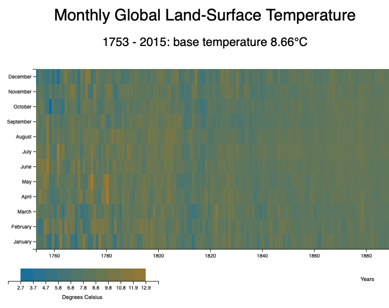

# 🚀 D3 Heatmap Project

This project demonstrates a basic heatmap using D3 and TypeScript.
Colors are interpolated to represent the average global surface temperatures.

Built as an assignment for the freeCodeCamp Data Visualization Certificate. 

A live build can be found [here](https://aaronishibashi.com/portfolio/web/d3-heat-map).

## Build

```
npm install
npm run build
```
